# AWS Microservice Architecture — Notes

These notes are based on handwritten diagrams covering the software delivery lifecycle, team roles, and AWS infrastructure for a microservices architecture.

> **Convention:** Content marked with *[Added]* was not in the original diagrams and has been added for completeness.

---

## 1. Software Delivery Lifecycle

### Three-Step Overview

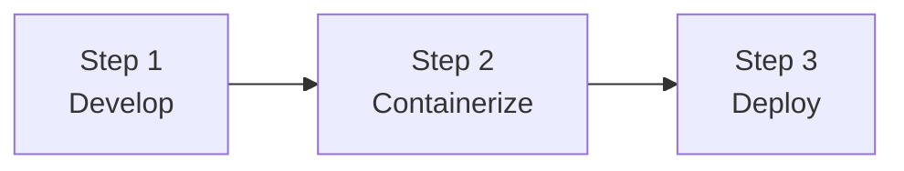

### Step 1 — Develop (SDE)

Build a Spring application with test cases.

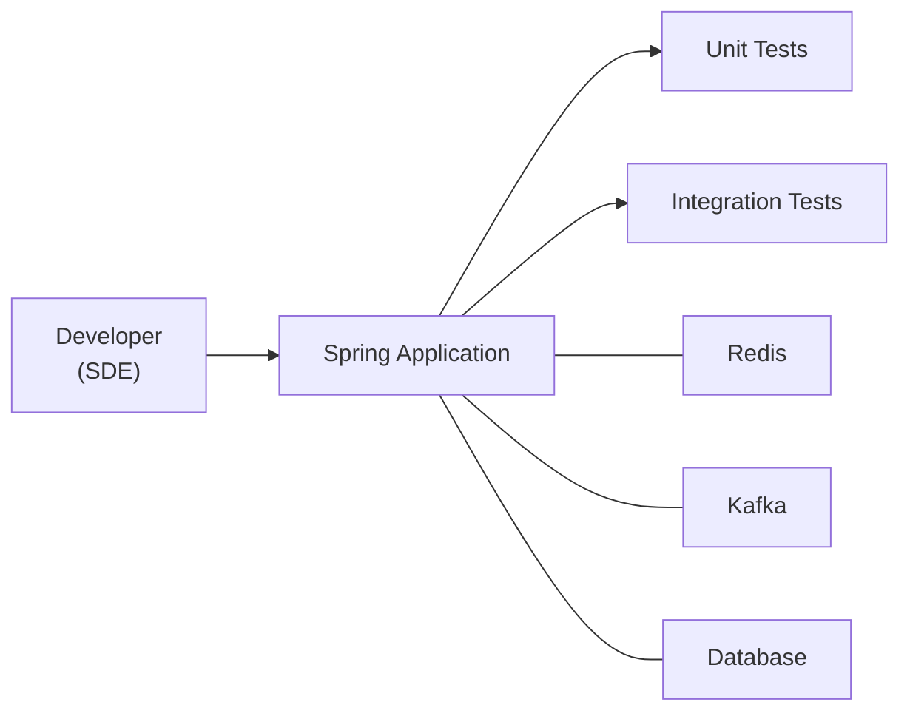

- **Role:** SDE (Software Development Engineer)
- **Experience level:** 4 years
- **Application:** Spring Boot
- **Dependencies:** Redis, Kafka, DB
- **Testing:** Unit tests + Integration tests (TCs)

### Step 2 — Containerize

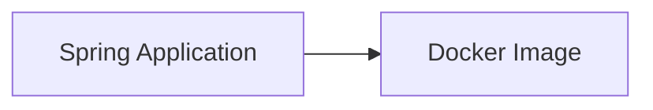

- Package the application into a Docker container

### Step 3 — Deploy

#### Platform Engineer Responsibilities

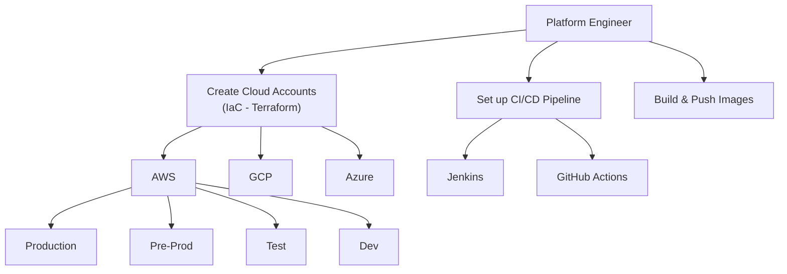

**CI/CD Flow (Platform Engineer):**

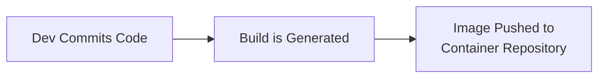

#### SRE Responsibilities

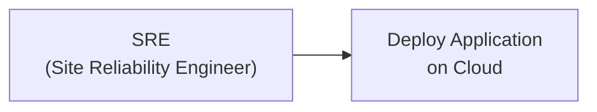

- **SRE** = Site Reliability Engineer
- Deploys the application to the cloud environment
- *[Added]* Responsible for monitoring, incident response, and ensuring system reliability

### Roles Summary

| Role | Responsibility |
|------|---------------|
| SDE | Develop Spring application, write unit & integration tests |
| Platform Engineer | IaC (Terraform), CI/CD pipelines, build & push images |
| SRE | Deploy application on cloud, site reliability |

---

## 2. AWS Architecture

### Source Control & CI/CD Tools

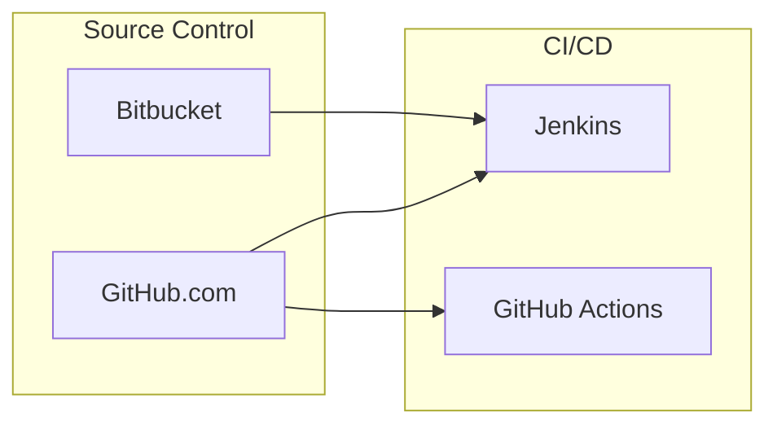

### Metering / Monitoring Tools

| Tool | Purpose |
|------|---------|
| Prometheus | Metrics collection |
| Datadog | Monitoring & analytics |
| Grafana | Dashboards & visualisation |

### AWS Dev Environment

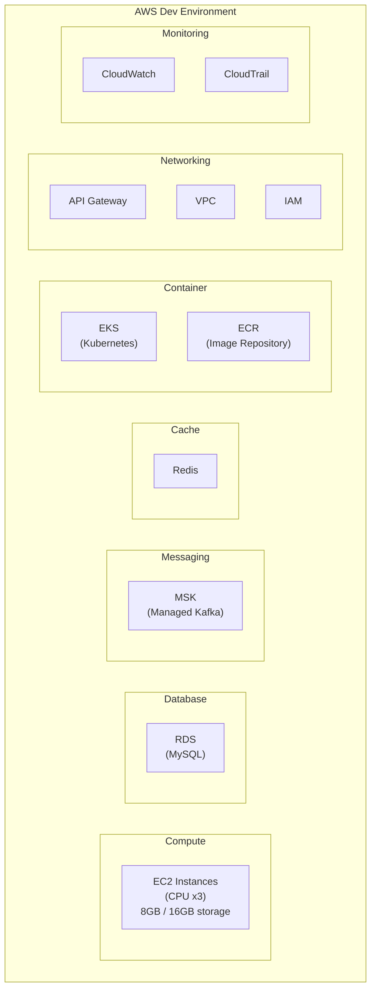

### AWS Services Summary

| Service | Category | Purpose |
|---------|----------|---------|
| EC2 | Compute | Application instances (8GB/16GB) |
| RDS (MySQL) | Database | Relational database |
| MSK | Messaging | Managed Streaming for Apache Kafka |
| Redis | Cache | In-memory caching |
| EKS | Container | Managed Kubernetes |
| ECR | Container | Docker image repository |
| API Gateway | Networking | API management & routing |
| VPC | Networking | Virtual Private Cloud |
| IAM | Security | Identity & Access Management |
| CloudWatch | Monitoring | Logs & metrics |
| CloudTrail | Monitoring | API activity audit trail |

---

## 3. Multi-AZ Deployment (Option 2)

### Load Balancer to Availability Zones

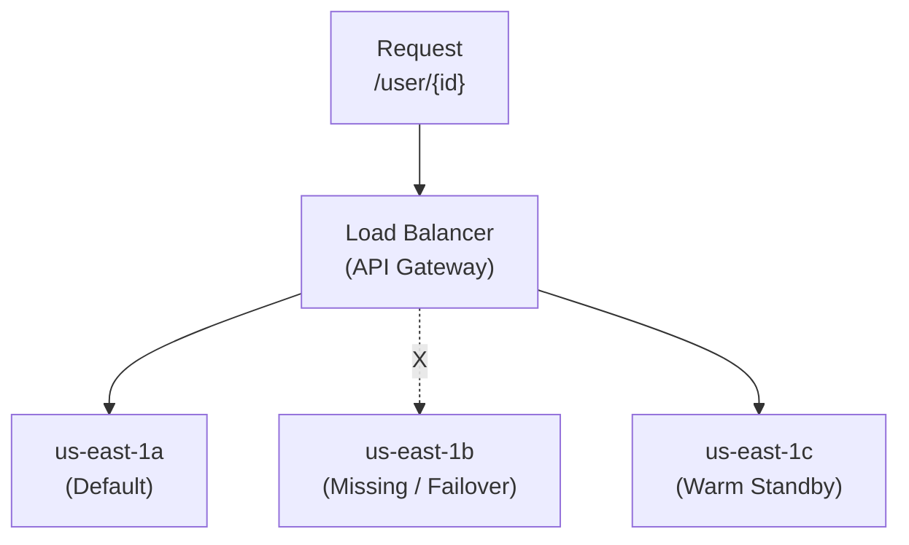

| Availability Zone | Status |
|-------------------|--------|
| us-east-1a | Default — primary traffic |
| us-east-1b | Missing / down — failover scenario |
| us-east-1c | Warm standby |

- *[Added]* Multi-AZ deployment provides high availability and fault tolerance. If one AZ becomes unavailable, traffic is routed to the remaining healthy AZs.

---

## 4. API Gateway + EKS Cluster — Microservices Routing

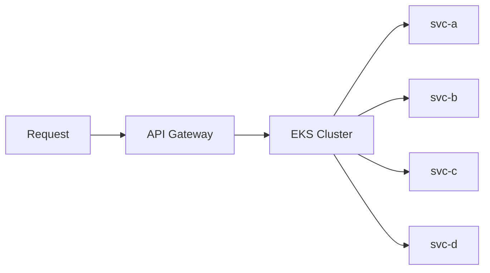

- API Gateway acts as the single entry point
- Routes requests to the appropriate microservice within the EKS cluster
- *[Added]* Each service (svc-a, svc-b, svc-c, svc-d) runs as a separate deployment/pod in Kubernetes, enabling independent scaling and deployment

---

## 5. End-to-End Flow *[Added]*

This section connects all the pieces from the diagrams into a single end-to-end flow.

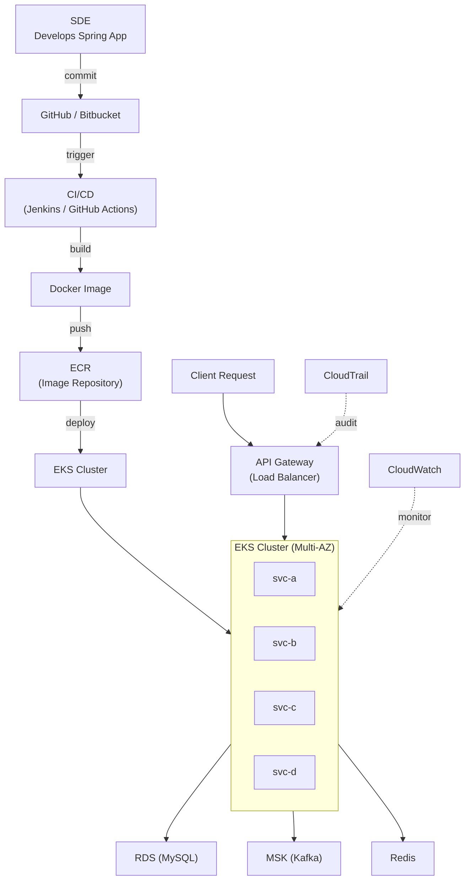

---

## 6. Template Note

The original diagram references an **SL Template** at the bottom of the first page. This likely refers to a service-level or solution template used as a starting point for architecture design.
